# Sushi Garden Android

A Russian-language sushi delivery app built in Kotlin for Android, following the same Figma design spec as the iOS counterpart with a full register → catalog → cart → checkout → live-tracking → order history flow.

---

## Screenshots

| Register | Login | Catalog |
|----------|-------|---------|
| 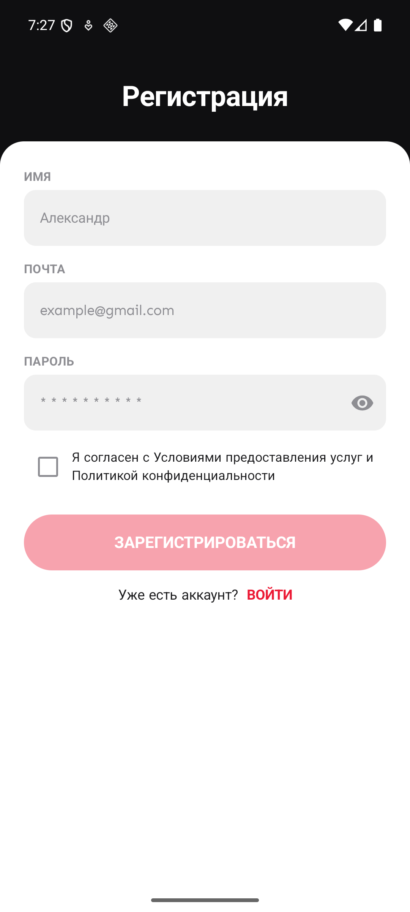 | 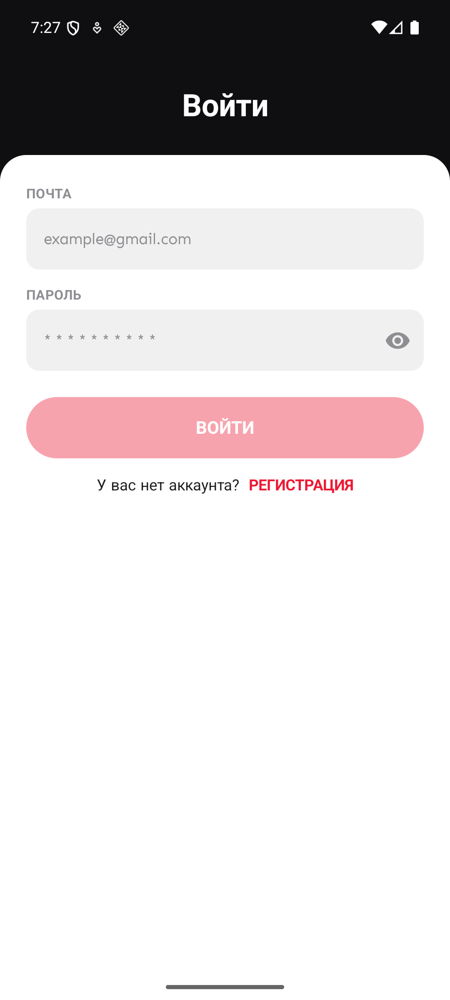 | 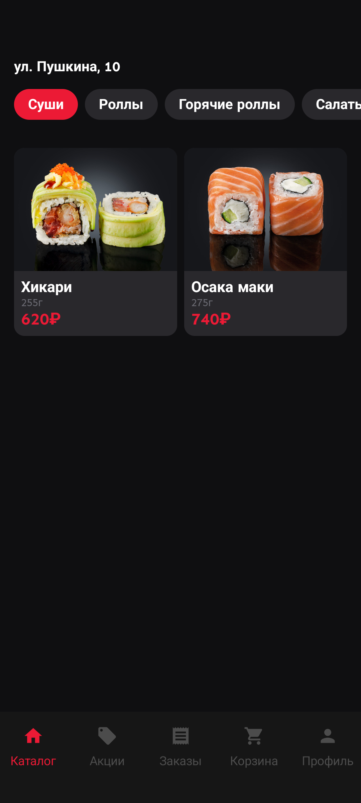 |

| Product Detail | Cart (empty) | Cart (filled) |
|----------------|--------------|---------------|
| 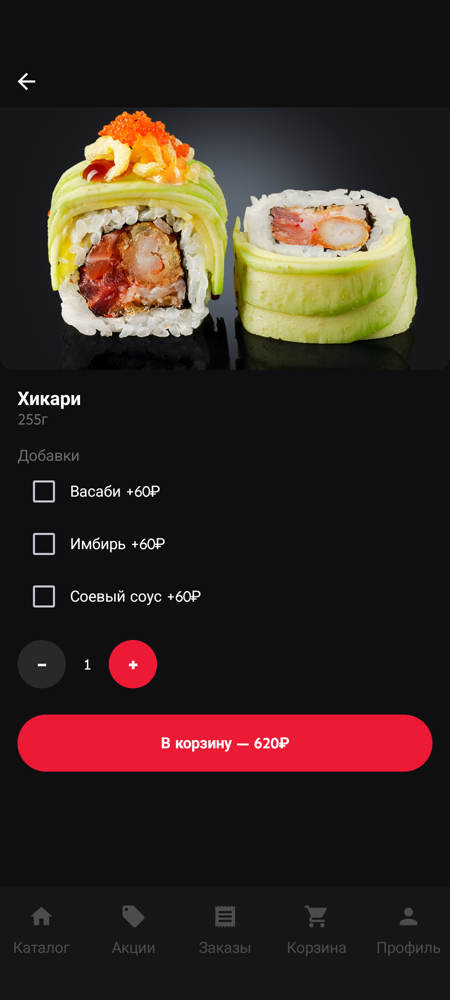 |  | 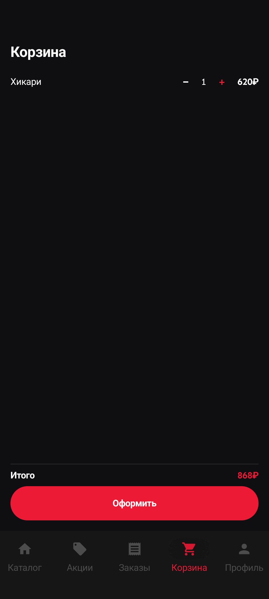 |

| Checkout | Live Tracking | Orders (empty) |
|----------|---------------|----------------|
| 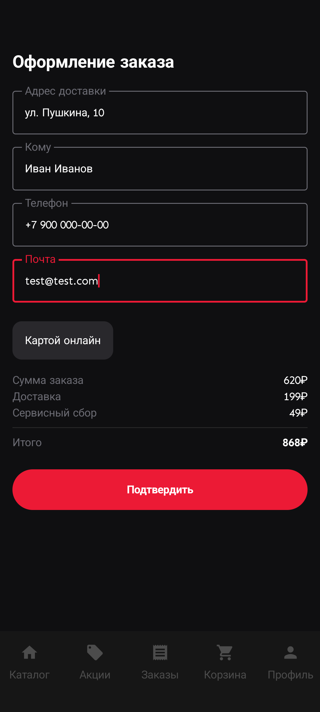 | 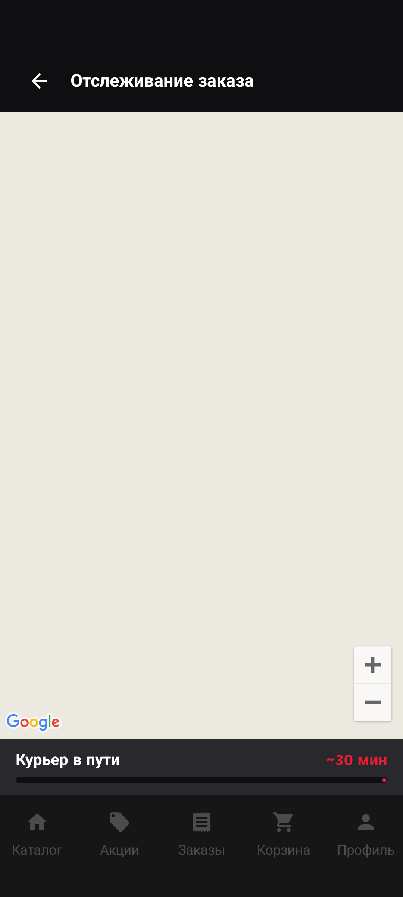 |  |

| Orders (filled) | Order Detail | Promotions | Profile |
|-----------------|--------------|------------|---------|
| 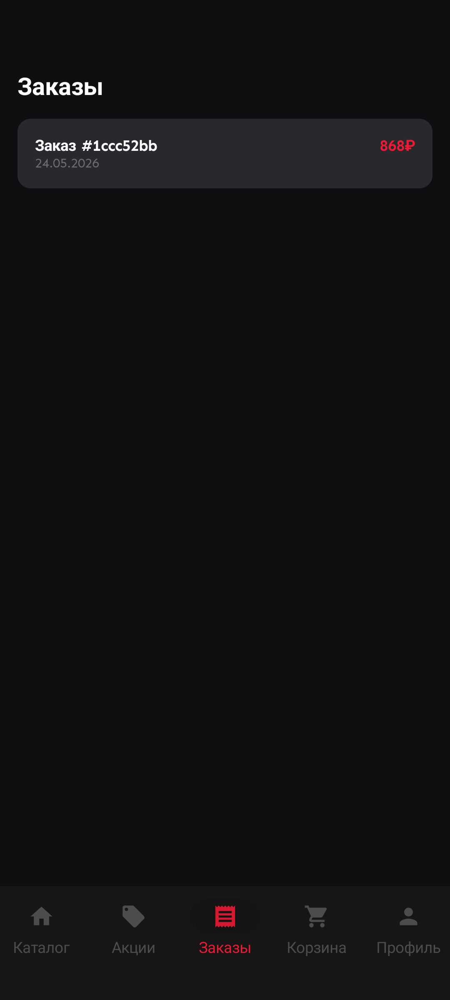 | 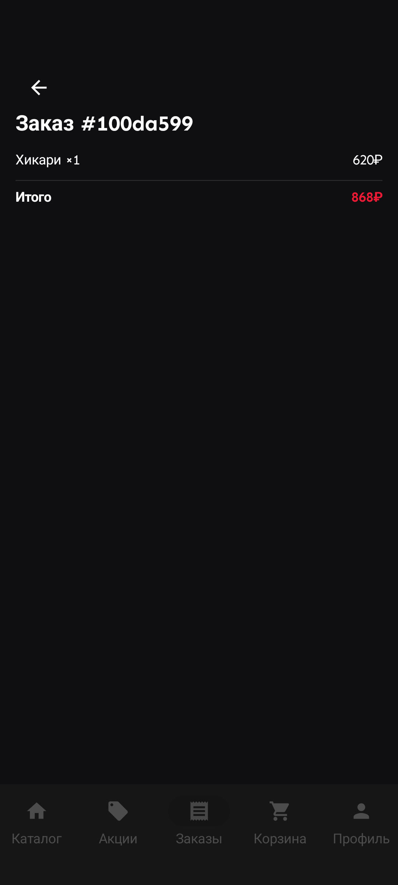 | 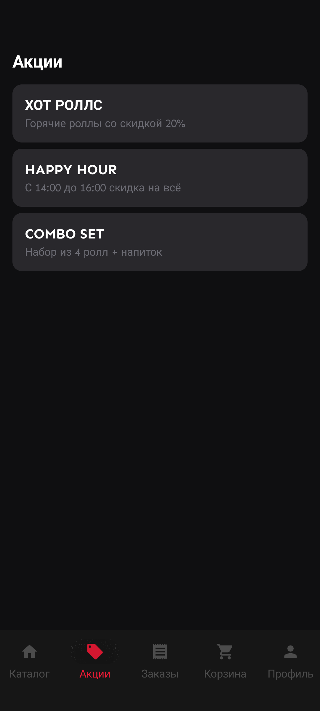 | 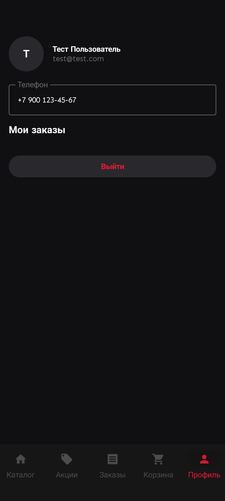 |

---

## Tech Stack

| Layer | Technology |
|-------|-----------|
| UI | Jetpack Compose (Material 3) |
| Architecture | MVVM + Kotlin Coroutines + StateFlow |
| DI | Hilt |
| Auth | Firebase Authentication KTX |
| Persistence | Room (orders) + in-memory (cart) |
| Maps | Google Maps Compose SDK |
| Navigation | Navigation Compose |
| Image loading | Coil |
| Tests | JUnit 4 (unit) + Compose UI Tests (instrumented) |

---

## Architecture

### Layer overview

```
┌──────────────────────────────────────────────┐
│                     App                       │
│  SushiGardenApp  →  MainActivity              │
│                  ↓                            │
│             Hilt DI (AppModule)               │
│   auth │ menu │ cart │ orders │ courier       │
└──────────────────┬───────────────────────────┘
                   │ injected via @HiltViewModel
          ┌────────┴────────┐
          │  NavGraph        │
          │  NavHostController                  │
          │  BottomNavBar (5 tabs)              │
          └────────┬────────┘
                   │
     ┌─────────────┴────────────────────────┐
     │        Compose Feature Screens        │
     │                                       │
     │  CatalogScreen  ──▶  ProductDetailScreen
     │  PromotionsScreen                     │
     │  CartScreen     ──▶  CheckoutScreen ──▶ TrackingScreen
     │  OrdersScreen   ──▶  OrderDetailScreen │
     │  ProfileScreen                        │
     └───────────────────────────────────────┘
```

### MVVM per feature

```
Screen (Composable)
  │  collectAsState()
  ▼
ViewModel (@HiltViewModel)
  │  StateFlow<UiState<T>>
  ▼
Service / Repository layer
  ├── AuthService          (FirebaseAuthService / FakeAuthService)
  ├── MenuRepository       (LocalMenuRepository — mock data)
  ├── CartService          (InMemoryCartService)
  ├── OrderDao             (Room DAO)
  └── CourierSimulator     (coroutine-based route animator)
```

### Authentication flow

```
App launch
    │
    ├─ isLoggedIn = true ──▶ NavGraph → CatalogScreen (default tab)
    │
    └─ false ──▶ AuthScreen (full-screen)
                    │
                    ├─ Register: name + email + password + consent
                    └─ Login:    email + password
                              │
                        FirebaseAuthService (prod)
                        FakeAuthService     (UI tests via @TestInstallIn)
                              │
                        onAuthSuccess() ──▶ NavGraph → CatalogScreen
```

### Checkout → Tracking flow

```
CartScreen
    │  user taps "Оформить"
    ▼
CheckoutScreen   (address / recipient / phone / email + fee summary)
    │  viewModel.confirm() →
    │    orderDao.insert(order.toEntity())   ← Room write
    │    cartService.clearCart()
    │    UiState.Success(orderId)
    ▼
TrackingScreen
    │
    ├─ GoogleMap + Marker (courier position, animated)
    ├─ CourierSimulator.start() — moves courier along route every 3 s
    └─ ETA countdown label + LinearProgressIndicator
```

### Data persistence

```
Room Database  (SushiGardenDatabase)
    └─ OrderEntity
           id, linesJson, subtotal, deliveryFee,
           serviceFee, total, addressJson, createdAt
               │
               JSON encode/decode ◀──▶ List<OrderLine>
               (Gson)

InMemoryCartService
    MutableStateFlow<CartState>
    ────────────────────────────────
    addItem()   — increments qty or inserts
    removeItem() — decrements qty, removes at 0
    clearCart()  — reset on order confirm
```

### Test strategy

```
Unit tests (JVM)                 UI / instrumented tests
────────────────────────────     ─────────────────────────────────
AuthViewModelTest                AuthScreenTest       (7 tests)
FakeAuthServiceTest              CatalogScreenTest    (4 tests)
CatalogViewModelTest             ProductDetailScreenTest (5 tests)
DesignSystemTest                 CartScreenTest       (6 tests)
                                 CheckoutScreenTest   (2 tests)
                                 OrdersScreenTest     (2 tests)
                                 OrderDetailScreenTest (2 tests)
                                 PromotionsScreenTest (2 tests)
                                 ProfileScreenTest    (3 tests)
                                 TrackingScreenTest   (4 tests)

            ↑                              ↑
    Real coroutine dispatcher      Hilt @TestInstallIn:
    UnconfinedTestDispatcher         FakeAuthService (pre-seeded user)
                                     InMemoryCartService
                                     In-memory Room DB
                                     captureAndSaveScreenshot() per test
```

**36 JVM unit tests** pass (4 test classes + `InMemoryCartServiceTest`, `CheckoutViewModelTest`, `CourierSimulatorTest`). **37 UI / instrumented tests** verified on Pixel 8 emulator (API 36).  
Every UI test calls `captureAndSaveScreenshot()` — PNGs saved to  
`/storage/emulated/0/Android/data/com.baha.sushigarden/files/screenshots/`.

---

## Project Structure

```
app/src/
├── main/
│   ├── java/com/baha/sushigarden/
│   │   ├── MainActivity.kt
│   │   ├── SushiGardenApp.kt
│   │   ├── UiState.kt                      ← sealed Idle/Loading/Success/Error
│   │   ├── data/
│   │   │   ├── models/                     CartItem, Order, Product, UserProfile …
│   │   │   └── services/
│   │   │       ├── auth/                   AuthService, FirebaseAuthService, FakeAuthService
│   │   │       ├── cart/                   CartService, InMemoryCartService
│   │   │       ├── catalog/                MenuRepository, LocalMenuRepository
│   │   │       ├── delivery/               CourierSimulator
│   │   │       └── orders/                 OrderDao, SushiGardenDatabase, OrderEntity
│   │   ├── di/
│   │   │   └── AppModule.kt                ← Hilt bindings
│   │   ├── features/
│   │   │   ├── auth/                       AuthScreen + AuthViewModel
│   │   │   ├── catalog/                    CatalogScreen + CatalogViewModel
│   │   │   ├── productdetail/              ProductDetailScreen + ProductDetailViewModel
│   │   │   ├── cart/                       CartScreen + CartViewModel
│   │   │   ├── checkout/                   CheckoutScreen + CheckoutViewModel
│   │   │   ├── tracking/                   TrackingScreen + TrackingViewModel
│   │   │   ├── orders/                     OrdersScreen + OrderDetailScreen + OrdersViewModel
│   │   │   ├── promotions/                 PromotionsScreen + PromotionsViewModel
│   │   │   └── profile/                    ProfileScreen + ProfileViewModel
│   │   ├── navigation/
│   │   │   ├── NavGraph.kt                 ← NavHost + Screen sealed class
│   │   │   └── BottomNavBar.kt
│   │   └── ui/designsystem/
│   │       ├── Color.kt                    ← SushiColors (Background, AccentRed …)
│   │       ├── Theme.kt                    ← SushiGardenTheme + SushiTypography (Sen font)
│   │       ├── Typography.kt               ← SenFontFamily
│   │       └── Spacing.kt                  ← xs/sm/md/lg/xl/cardCorner
│   └── res/
│       ├── drawable/                       product images, promo banners
│       └── font/                           sen_regular.ttf, sen_bold.ttf
├── androidTest/
│   └── java/com/baha/sushigarden/
│       ├── HiltTestActivity.kt
│       ├── HiltTestRunner.kt
│       ├── ScreenshotCapture.kt
│       ├── di/TestModule.kt                ← @TestInstallIn replaces AppModule
│       └── features/*/                     one *ScreenTest.kt per feature
└── test/
    └── java/com/baha/sushigarden/
        ├── DesignSystemTest.kt
        └── features/auth/                  AuthViewModelTest, FakeAuthServiceTest
            features/catalog/               CatalogViewModelTest
```

---

## Design System

Tokens are mirrored from the Figma file (`wOK1MMzuJZF3pIOZhGHpY9`) and match the iOS counterpart exactly.

| Token | Value | Usage |
|-------|-------|-------|
| `Background` | `#0F0F11` | Screen background |
| `CardSurface` | `#29282C` | Cards, bottom sheet surfaces |
| `TabBar` | `#161616` | Bottom navigation bar |
| `AccentRed` | `#EC1A35` | Primary action color |
| `PrimaryText` | `#FFFFFF` | Body + headline text |
| `SecondaryText` | `#6C6C74` | Captions, labels |
| `IconInactive` | `#4C4C4C` | Unselected nav icons |
| `Divider` | `#2A2A2A` | Horizontal dividers |
| `cardCorner` | `12dp` | Card corner radius |
| Font | **Sen** (Regular + Bold) | All text — `sen_regular.ttf`, `sen_bold.ttf` |

---

## Setup

### Prerequisites

- Android Studio Hedgehog (2023.1) or newer
- Android SDK 36, min SDK 26
- JDK 17
- A connected emulator or device (API 26+)

### Steps

```bash
git clone <repo>
cd sushi-garden-android-claude-code
```

Add two files that are excluded from the repo:

**`app/google-services.json`** — Firebase credentials (same project as the iOS app).  
Without this the app builds, but Firebase Auth (login/register) will fail at runtime.

**`local.properties`** — add your Google Maps API key:
```
MAPS_API_KEY=YOUR_KEY_HERE
```
Without a valid key the map tile on TrackingScreen will not load; all other screens work normally.

```bash
# Build and run on connected emulator/device
./gradlew :app:installDebug
```

---

## Running Tests

### Unit tests (JVM — no device needed)

```bash
./gradlew :app:test
```

### UI / instrumented tests

The test APK uses `@TestInstallIn` to replace Firebase with `FakeAuthService`  
(pre-seeded user, no network required) and Room with an in-memory database.

```bash
# Build both APKs
./gradlew :app:assembleDebug :app:assembleDebugAndroidTest

# Install
adb install -r -t app/build/outputs/apk/debug/app-debug.apk
adb install -r -t app/build/outputs/apk/androidTest/debug/app-debug-androidTest.apk

# Run all 37 UI tests
adb shell am instrument -w -r \
  -e class "com.baha.sushigarden.features.auth.AuthScreenTest,\
com.baha.sushigarden.features.catalog.CatalogScreenTest,\
com.baha.sushigarden.features.productdetail.ProductDetailScreenTest,\
com.baha.sushigarden.features.cart.CartScreenTest,\
com.baha.sushigarden.features.checkout.CheckoutScreenTest,\
com.baha.sushigarden.features.orders.OrdersScreenTest,\
com.baha.sushigarden.features.orders.OrderDetailScreenTest,\
com.baha.sushigarden.features.promotions.PromotionsScreenTest,\
com.baha.sushigarden.features.profile.ProfileScreenTest,\
com.baha.sushigarden.features.tracking.TrackingScreenTest" \
  com.baha.sushigarden.test/com.baha.sushigarden.HiltTestRunner

# Pull screenshots after the run
adb pull /storage/emulated/0/Android/data/com.baha.sushigarden/files/screenshots/ ./screenshots/
```

> **Note:** The `connectedDebugAndroidTest` Gradle task uninstalls the APK after the run, which  
> deletes scoped-storage screenshots. Use the `adb install` + `am instrument` + `adb pull`  
> workflow above to preserve them.

All **37 tests pass** on a Pixel 8 emulator (API 36, 1080×2400 @ 420 dpi).
